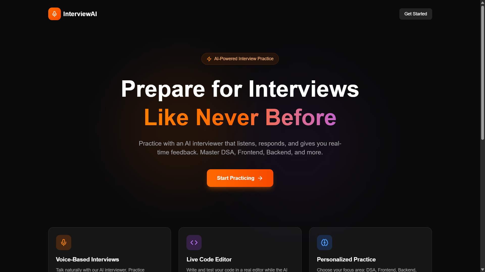
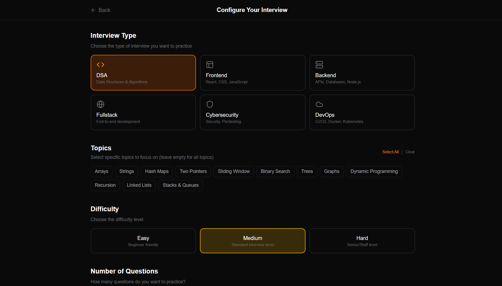
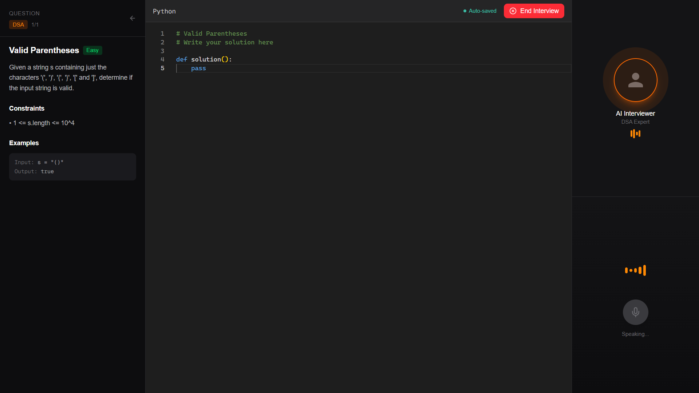
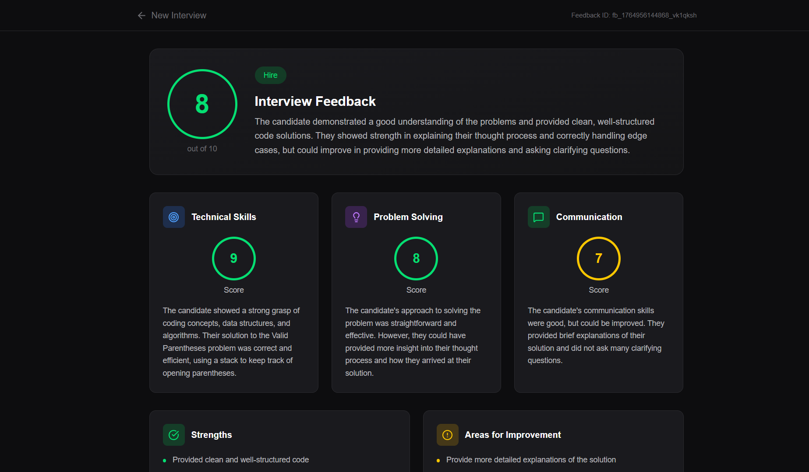

<div align="center">
  
  
  
  
</div>

<h1 align="center">🎤 InterviewAI</h1>

<p align="center">
  <strong>Practice technical interviews with an AI interviewer that listens, responds, and provides real-time feedback.</strong>
</p>

<p align="center">
  <a href="#-features">Features</a> •
  <a href="#-demo">Demo</a> •
  <a href="#️-tech-stack">Tech Stack</a> •
  <a href="#-getting-started">Getting Started</a> •
  <a href="#-architecture">Architecture</a> •
  <a href="#-why-this-project">Why This Project</a>
</p>

---

## ✨ Features

### 🎯 Multiple Interview Types
- **DSA (Data Structures & Algorithms)** - LeetCode-style coding problems with live code editor
- **Frontend** - React, JavaScript, CSS, TypeScript discussions
- **Backend** - APIs, Databases, System Design, Microservices
- **Fullstack** - End-to-end application development
- **Cybersecurity** - OWASP, Penetration Testing, Security Best Practices
- **DevOps** - Docker, Kubernetes, CI/CD, Cloud Infrastructure

### 🗣️ Voice-Powered Conversations
- **Real-time Speech Recognition** using Deepgram's Nova-2 model
- **Natural AI Responses** powered by Groq's Llama 3.3 70B
- **Human-like Text-to-Speech** using Murf AI's realistic voices
- Talk naturally, just like in a real interview!

### 💻 Live Code Editor
- Monaco Editor (VS Code's engine) for DSA interviews
- Syntax highlighting, auto-completion, and error detection
- Code is automatically analyzed by the AI interviewer
- Real-time feedback on your implementation

### 📊 Detailed Feedback Reports
- **Overall Score** (1-10) with hiring verdict
- **Category Scores** - Technical Skills, Problem Solving, Communication
- **Strengths & Improvement Areas** - Specific, actionable feedback
- **Personalized Recommendations** - What to study next
- **Export as PDF** - Download and share your results

### ⚙️ Personalized Practice
- Choose your interview type and difficulty level
- Select specific topics to focus on
- Configure number of questions (1-10)
- Dynamic prompts adapt to your selections

---

## 🎬 Demo

### Homepage


### Interview Setup


### Live Interview


### Feedback Report


---

## 🛠️ Tech Stack

| Category | Technology | Purpose |
|----------|------------|---------|
| **Framework** | Next.js 15 (App Router) | React framework with server components |
| **Language** | TypeScript | Type-safe development |
| **Styling** | Tailwind CSS | Utility-first CSS framework |
| **Code Editor** | Monaco Editor | VS Code's editor in the browser |
| **Speech-to-Text** | Deepgram Nova-2 | Real-time audio transcription |
| **LLM** | Groq (Llama 3.3 70B) | Ultra-fast AI responses |
| **Text-to-Speech** | Murf AI | Natural, human-like voices |
| **Icons** | Lucide React | Beautiful, consistent icons |
| **Animations** | Framer Motion | Smooth UI animations |

### Why These Technologies?

- **Next.js 15**: Server components reduce client bundle size, API routes simplify backend
- **Groq**: 10x faster inference than OpenAI, free tier available
- **Deepgram**: Industry-leading accuracy, real-time streaming support
- **Murf AI**: Most natural-sounding TTS, multiple voice options
- **Monaco Editor**: Full IDE experience without leaving the browser

---

## 🚀 Getting Started

### Prerequisites

- Node.js 18+ installed
- npm or yarn package manager
- API keys for: Groq, Deepgram, Murf AI

### Installation

1. **Clone the repository**
   ```bash
   git clone https://github.com/yourusername/interview-ai.git
   cd interview-ai/ai_interview
   ```

2. **Install dependencies**
   ```bash
   npm install
   ```

3. **Set up environment variables**
   
   Create a `.env.local` file in the root directory:
   ```env
   # Groq - Get free API key at https://console.groq.com
   GROQ_API_KEY=your_groq_api_key
   
   # Deepgram - Get free API key at https://console.deepgram.com
   DEEPGRAM_API_KEY=your_deepgram_api_key
   
   # Murf AI - Get API key at https://murf.ai/api
   MURF_API_KEY=your_murf_api_key
   ```

4. **Run the development server**
   ```bash
   npm run dev
   ```

5. **Open in browser**
   
   Navigate to [http://localhost:3000](http://localhost:3000)

### Getting API Keys

| Service | Free Tier | Sign Up Link |
|---------|-----------|--------------|
| **Groq** | 6,000 tokens/min, 14,400 requests/day | [console.groq.com](https://console.groq.com) |
| **Deepgram** | $200 free credits | [console.deepgram.com](https://console.deepgram.com) |
| **Murf AI** | 10,000 credits free | [murf.ai](https://murf.ai) |

---

## 🏗️ Architecture

```
┌─────────────────────────────────────────────────────────────────┐
│                         Frontend (Next.js)                       │
├─────────────────────────────────────────────────────────────────┤
│  Homepage (/)  →  Setup (/setup)  →  Interview (/interview)     │
│       ↓                ↓                     ↓                   │
│   Hero + CTA      Config Form           Voice + Code UI          │
└─────────────────────────────────────────────────────────────────┘
                              │
                              ▼
┌─────────────────────────────────────────────────────────────────┐
│                       API Routes                                 │
├─────────────────────────────────────────────────────────────────┤
│  /api/generate-question  │  Generate interview questions        │
│  /api/generate-intro     │  Create AI introduction with TTS     │
│  /api/process-turn       │  Handle voice input → AI → TTS       │
│  /api/feedback           │  Generate detailed performance report │
└─────────────────────────────────────────────────────────────────┘
                              │
                              ▼
┌─────────────────────────────────────────────────────────────────┐
│                     External Services                            │
├─────────────────────────────────────────────────────────────────┤
│  Deepgram (STT)  →  Groq LLM  →  Murf AI (TTS)                  │
│     Audio           Text          Audio                          │
└─────────────────────────────────────────────────────────────────┘
```

### Key Design Decisions

1. **Server-Side API Calls**: All AI service calls happen on the server, keeping API keys secure
2. **Streaming Audio**: Audio is processed as base64 to avoid file system dependencies
3. **Fallback Questions**: If AI generation fails, pre-defined quality questions are used
4. **Retry Logic**: TTS calls include automatic retry with exponential backoff
5. **Type-Safe**: Full TypeScript coverage with strict mode enabled

---

## 💡 Why This Project?

### The Problem

Technical interviews are stressful. Candidates often struggle because:
- **No practice partner** - Friends aren't always available
- **Expensive coaching** - Mock interviews cost $100-300+ each
- **Text-based prep** - LeetCode doesn't simulate real conversations
- **Limited feedback** - Hard to know what you're doing wrong

### The Solution

InterviewAI provides:
- **24/7 availability** - Practice anytime, anywhere
- **Free to use** - Uses free API tiers intelligently
- **Voice-first** - Simulate the real interview experience
- **Instant feedback** - AI analyzes your performance in detail
- **Multiple domains** - Not just DSA, but full-stack, security, DevOps too

### What Makes This Special?

1. **Real Conversation Flow**: Unlike chatbots, this feels like talking to a real interviewer
2. **Adaptive Difficulty**: Prompts adjust based on your selected level and topics
3. **Comprehensive Analysis**: Feedback covers technical skills, communication, and problem-solving
4. **Production Quality**: Error handling, retries, fallbacks - built for reliability
5. **Beautiful UI**: Dark mode, animations, professional design

---

## 📁 Project Structure

```
ai_interview/
├── src/
│   ├── app/
│   │   ├── page.tsx              # Landing page
│   │   ├── setup/page.tsx        # Interview configuration
│   │   ├── interview/page.tsx    # Main interview interface
│   │   ├── feedback/page.tsx     # Results & feedback
│   │   └── api/
│   │       ├── generate-question/  # Question generation
│   │       ├── generate-intro/     # AI introduction
│   │       ├── process-turn/       # Voice processing
│   │       └── feedback/           # Feedback generation
│   ├── components/
│   │   ├── CodeEditor.tsx        # Monaco editor wrapper
│   │   └── VoiceInterface.tsx    # Voice visualization
│   └── lib/
│       ├── types.ts              # TypeScript interfaces
│       └── utils.ts              # Helper functions
├── .env.local                    # Environment variables
└── package.json
```

---

## 🔮 Future Roadmap

- [ ] **Video Recording** - Record and review your interview sessions
- [ ] **Progress Tracking** - Dashboard with historical performance
- [ ] **Custom Questions** - Upload your own question bank
- [ ] **Company-Specific Prep** - FAANG-style question patterns
- [ ] **Multiplayer Mode** - Practice with friends in real-time
- [ ] **Mobile App** - React Native version for on-the-go practice

---

## 🤝 Contributing

Contributions are welcome! Please feel free to submit a Pull Request.

1. Fork the repository
2. Create your feature branch (`git checkout -b feature/AmazingFeature`)
3. Commit your changes (`git commit -m 'Add some AmazingFeature'`)
4. Push to the branch (`git push origin feature/AmazingFeature`)
5. Open a Pull Request

---

## 📄 License

This project is licensed under the MIT License - see the [LICENSE](LICENSE) file for details.

---

<div align="center">
  <p>Built with ❤️ for developers who want to ace their next interview</p>
  <p>
    <a href="https://github.com/yourusername/interview-ai">⭐ Star this repo</a> •
    <a href="https://github.com/yourusername/interview-ai/issues">🐛 Report Bug</a> •
    <a href="https://github.com/yourusername/interview-ai/issues">✨ Request Feature</a>
  </p>
</div>
